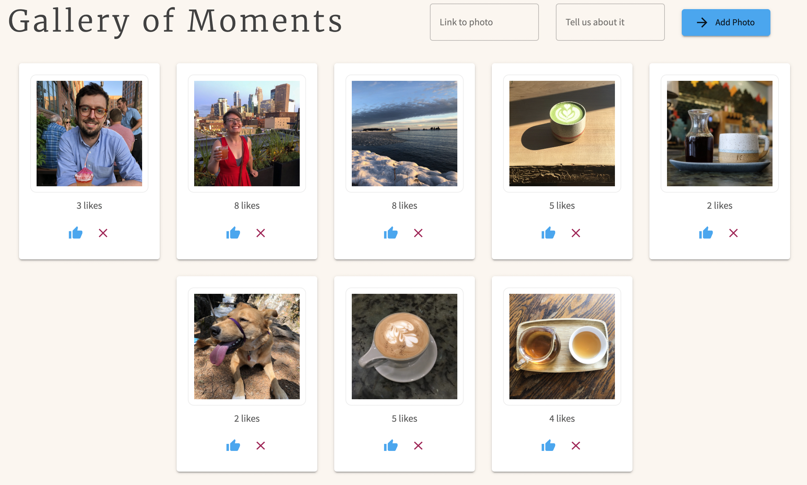

# React Gallery

## Description

_Duration: Weekend Assignment_

This project was our first weekend assignment using React. It demonstrated the use
of state and conditional rendering. Additionally, us folks in the Zhu cohort were
the first to learn React using a new curriculum at Prime, focusing on using
Hooks and functional components, as opposed to Classes.

## Screen Shots

- Gallery

## Prerequisites

- [Node.js](https://nodejs.org/en/)
- [Postgres](https://www.postgresql.org/download/)

## Installation

1. Create a database named `react_gallery`.
2. The queries for creating the database table are in `database.sql`. The project is built on [Postgres](https://www.postgresql.org/download/), so you will need to make sure to have that installed. We recommend using Postico to run those queries as that was used to create the queries.
3. Open up your editor of choice and run an `npm install`.
4. Run `npm run server` in your terminal.
5. Run `npm run client` in your terminal, which will open a new browser tab for you.

## Usage

This is a photo gallery app, with the ability to add likes to photos, as well
as click them to see a caption. New photos can also be added, as well as deleted from the database.

## Built With

- React
- Node.js
- Express
- Postgres

## Acknowledgement

Thanks to [Prime Digital Academy](www.primeacademy.io) who equipped and helped me to make this application a reality.

## Support

If you have suggestions or issues, please [email me](percburk@gmail.com)!